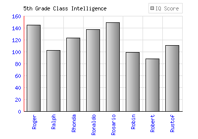
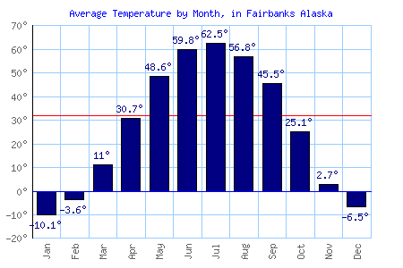
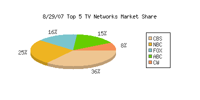
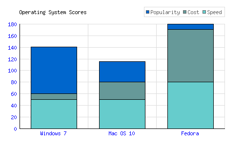

# PHPGraphLib Graphing Library

###  PHPGraphLib is a lightweight PHP server-side graphing library that creates graphs and charts

PHPGraphLib has powerful customization features allowing you to generate the perfect bar, line, stacked bar, or pie graph for any web application. Used with dynamic data, PHPGraphLib allows easy visual interpretation of sophisticated data sets. Simply feed PHPGraphLib an array of data points and it will generate a .png chart of your data to be displayed on a web page or saved to a file.

PHPGraphLib adjusts the scale and axis of the graph to fit any data, including large numbers, decimal numbers, and negative numbers. PHPGraphlib currently supports up to 5 datasets on one graph or chart.

### Changelog

##### 2026:
- Documentation scraped from the internet history, rewritten to reflect the updated version of the library and added to this repository

- Removed deprecated functions

- Replaced eval()'d code with much safer code

- Rewritten the initialisation of the objects

- Rewritten output control

- Fixed character set problems

- Added missing variables to the class definition

- Added support for the Euro currency

- Added example / rewrote examples

### Documentation

[Documentation](./docs) is included in this repository.

### Examples

Within the [Examples](./examples) directory are examples of PHPGraphLib usage.

Git clone this repo to a directory on your localhost or server to see these examples in action.

### Authors & License
The software is re-released under MIT. For more information read the [License](./LICENSE.txt).

